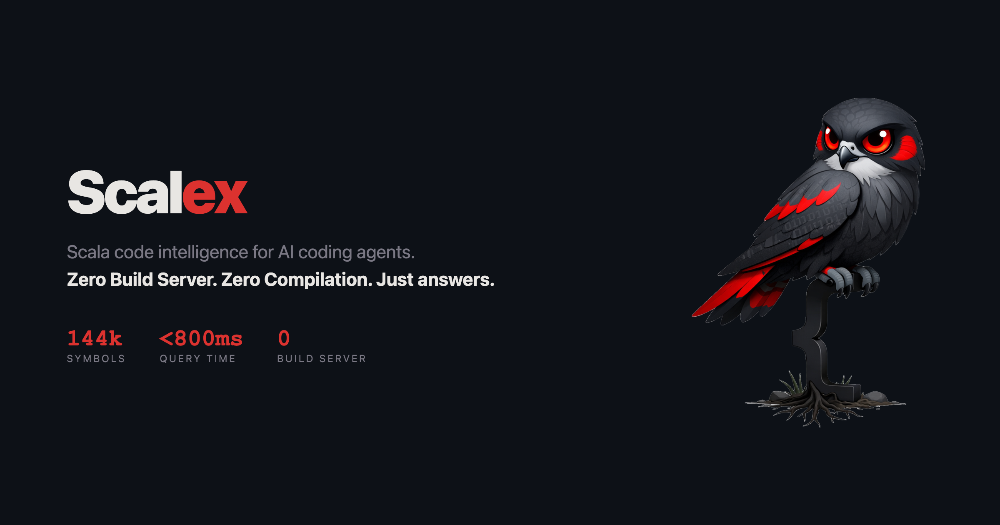

<p align="center">
  <picture>
    <source media="(prefers-color-scheme: dark)" srcset="site/readme-banner-dark.png">
    <source media="(prefers-color-scheme: light)" srcset="site/readme-banner-light.png">
    
  </picture>
  <br>
  <em>Grep knows text. Scalex knows Scala.</em>
  <br>
  <sub>Think grep, but it understands Scala's AST — so it finds symbols, not just strings.</sub>
</p>

---

## Table of Contents

- [Why Scalex?](#why-scalex)
- [The Problem](#the-problem)
- [Design Principles](#design-principles)
- [How It Works](#how-it-works)
- [Quick Start](#quick-start)
- [Usage Examples](#usage-examples)
- [Commands](#commands)
- [What Makes It Coding-Agent-Friendly](#what-makes-it-coding-agent-friendly)
- [Scalex vs Grep — Honest Comparison](#scalex-vs-grep--honest-comparison)
- [Scalex vs Metals](#scalex-vs-metals)
- [Credits](#credits)
- [Name](#name)
- [Mascot](#mascot)
- [License](#license)

---

## Why Scalex?

1. **No build server. Nothing to leak.** No daemon, no background process, no socket. No build server silently eating RAM, leaking threads, or grinding your CPU. The index is a single file in your repo — when scalex exits, nothing is left running. See [how it works](#how-it-works).

2. **Zero setup. Just works.** Install the skill, point it at any git repo, start navigating. No build files, no config, no "import build" dialog, no "connecting to build server". Clone a repo you've never seen and explore it in seconds. See [quick start](#quick-start).

3. **Smarter than grep.** Categorized references with confidence ranking. Wildcard import resolution (finds 1,205 importers where grep finds 17). Transitive inheritance trees. Structural AST search. Things grep fundamentally cannot do. See the [honest comparison](#scalex-vs-grep--honest-comparison) for real examples.

4. **Composite commands.** `explain` returns definition + scaladoc + members + implementations + import count in one shot. `refs --count` triages impact in one line. Designed to minimize tool calls — the biggest cost for coding agents isn't latency, it's the number of round trips. See [what makes it coding-agent-friendly](#what-makes-it-coding-agent-friendly) for the full picture.

---

After [installing](#quick-start), clone a project and ask Claude to explore it:

| Project | Clone | Prompt |
|---|---|---|
| **Scala 3 compiler** | `git clone --depth 1 https://github.com/scala/scala3.git` | *"Use scalex to explore how the Scala 3 compiler turns source file into bytecode."* |
| **Scala.js** | `git clone --depth 1 https://github.com/scala-js/scala-js.git` | *"Use scalex to explore how Scala.js turns Scala code into JavaScript."* |

Scalex indexes the codebase in seconds, then navigates definitions, traces implementations, and explores the architecture — all without a build server or compilation.

https://github.com/user-attachments/assets/09391648-1e3a-409c-ad52-19afa99ea81f

---

## The Problem

Coding agents (Claude Code, Cursor, Codex) are powerful, but they're blind in large Scala codebases. When an agent needs to find where `PaymentService` is defined, it has two options:

1. **Grep** — fast, but dumb. Returns raw text. Can't filter by symbol kind, doesn't know a trait from a usage. The agent has to construct regex patterns and parse raw output.

2. **Metals LSP** — smart, but heavy. Requires a build server, full compilation, minutes of startup. Designed for humans in IDEs, not agents making quick tool calls.

## Design Principles

Scalex takes only the source-level indexing layer of a language server — definitions, references, implementations, hierarchy — and parses it directly from source with Scalameta. No build, no classpath, no daemon. The tradeoff: when two packages both define a class called `Config`, scalex can't tell which one `extends Config` refers to — that requires type resolution. The upside: clone any repo, index 17k files in seconds, and start navigating immediately.

- **One command = one answer.** No multi-step reasoning, no regex construction.
- **Structured output.** Symbol kind, package, file path, line number. Not raw text.
- **Scala 2 and 3.** Enums, givens, extensions, implicit classes, procedure syntax — auto-detected per file.
- **Java files.** `.java` files are also indexed with lightweight regex extraction (class/interface/enum/record).
- **Honest about limits.** When it can't find something, it tells the agent what to try next.

## How It Works

Here's the architecture (generated with `scalex graph --render`):

<!-- scalex graph --render "scalex CLI->WorkspaceIndex, WorkspaceIndex->git ls-files, WorkspaceIndex->Scalameta AST, WorkspaceIndex->.scalex/index.bin" -->
```
                   ┌──────────┐
                   │scalex CLI│
                   └─────┬────┘
                         │
                         v
                 ┌──────────────┐
                 │WorkspaceIndex│
                 └───┬────┬──┬──┘
                     │    │  │
        ┌────────────┘    │  └──────────────┐
        │                 │                 │
        v                 v                 v
 ┌─────────────┐ ┌─────────────────┐ ┌────────────┐
 │Scalameta AST│ │.scalex/index.bin│ │git ls-files│
 └─────────────┘ └─────────────────┘ └────────────┘
```

- **scalex CLI** — 30 commands: search, def, impl, refs, imports, members, graph, ...
- **WorkspaceIndex** — lazy indexes: symbolsByName, parentIndex, filesByPath, bloom filters
- **git ls-files** — `--stage` returns path + OID per tracked file (change detection)
- **Scalameta AST** — Source → AST → SymbolInfo, BloomFilter, imports, parents
- **.scalex/index.bin** — binary cache with string interning (skip unchanged files)

### Pipeline

```
  1. git ls-files --stage
     │  Every tracked .scala file with its content hash (OID).
     │  ~40ms for 18k files.
     │
  2. Compare OIDs against cached index
     │  Unchanged files are skipped entirely.
     │  0 changes = 0 parses.
     │
  3. Scalameta parse (parallel)
     │  Source → AST → symbols, bloom filters, imports, parents.
     │  All CPU cores via Java parallel streams.
     │
  4. Save to .scalex/index.bin
     │  Binary format with string interning.
     │  Loads in ~225ms for 144k+ symbols.
     │
  5. Answer the query
     │  Maps build lazily — each query only pays for the indexes it needs.
```

### Performance

| Project | Files | Symbols | Cold Index | Warm Index |
|---|---|---|---|---|
| Production monorepo | 14,219 | 170,094 | 5.3s | 445ms |
| Scala 3 compiler | 18,485 | 144,211 | 2.7s | 349ms |

## Quick Start

### Claude Code (recommended)

Installs the binary + skill (teaches Claude when and how to use scalex) in one step:

```bash
/plugin marketplace add nguyenyou/scalex
/plugin install scalex@scalex-marketplace
```

Then try:

> *"use scalex to explore how authentication works in this codebase"*

### Other coding agents

Copy the skill folder to wherever your agent reads skills — that's it. The included bootstrap script auto-downloads and caches the native binary on first run.

```bash
# Clone and copy the skill folder
git clone --depth 1 https://github.com/nguyenyou/scalex.git /tmp/scalex
cp -r /tmp/scalex/plugins/scalex/skills/scalex /path/to/your/agent/skills/
```

The skill folder contains everything: `SKILL.md` (teaches the agent when and how to use scalex), reference docs, and a bootstrap script that downloads the correct binary for your platform.

### How the bootstrap script works

You don't install scalex manually — the skill includes a bootstrap script (`scripts/scalex-cli`) that handles everything:

1. **Detects your platform** (macOS arm64, macOS x64, Linux x64)
2. **Downloads the correct native binary** from GitHub Releases on first run
3. **Verifies the SHA-256 checksum** against pinned hashes in the script
4. **Caches the binary** at `~/.cache/scalex/` (follows XDG spec)
5. **Auto-upgrades** when the skill version changes — old cached binaries are left in place, new version is downloaded alongside

The coding agent invokes scalex through this script on every call. After the first run (~2s download), subsequent calls go straight to the cached binary with zero overhead.

### Advanced: customize or override

If you prefer to build from source or use your own binary, you have two options:

**Option A: Put your binary on PATH and edit the skill.**
Build scalex, place it anywhere on your `PATH`, then update `SKILL.md` to invoke `scalex` directly instead of `bash "/path/to/scripts/scalex-cli"`.

**Option B: Edit the bootstrap script to use a local binary.**
Set the `BINARY` variable in `scripts/scalex-cli` to point to your local build — the script will skip the download and exec your binary directly.

#### Build from source

Requires [scala-cli](https://scala-cli.virtuslab.org/) + [GraalVM](https://www.graalvm.org/):

```bash
git clone https://github.com/nguyenyou/scalex.git
cd scalex
./build-native.sh
# Output: ~30MB standalone binary, no JVM needed
```

#### Run from source (no native image)

If you have [scala-cli](https://scala-cli.virtuslab.org/) installed, you can run directly from source without building a native image:

```bash
git clone https://github.com/nguyenyou/scalex.git
scala-cli run scalex/src/ -- search /path/to/project MyClass
```

Downloads dependencies on first run (~5s), then starts in ~1s. Useful for development or quick testing.

## Usage Examples

```bash
cd /path/to/your/scala/project

# Discover
scalex search Service --kind trait         # Find traits by name
scalex search hms                          # Fuzzy camelCase: finds HttpMessageService
scalex search find --returns Boolean       # Filter by return type
scalex file PaymentService                 # Find files by name (like IntelliJ)
scalex packages                            # List all packages
scalex package com.example                 # Explore a specific package
scalex api com.example                     # What does this package export?
scalex api com.example --used-by com.web   # Coupling: what does web use from example?
scalex summary com.example                 # Sub-packages with symbol counts
scalex entrypoints                         # Find @main, def main, extends App, test suites
scalex overview --concise                  # Fixed-size ~60-line summary for large codebases
scalex graph --render "A->B, B->C, A->D"   # Render directed graph as ASCII/Unicode art
scalex graph --parse < diagram.txt         # Parse ASCII diagram into boxes + edges

# Understand
scalex def UserService --verbose           # Definition with signature
scalex def UserService.findUser            # Owner.member dotted syntax
scalex explain UserService --verbose       # One-shot: def + doc + signatures + impls
scalex explain UserService --inherited     # Include inherited members from parents
scalex explain UserService --no-doc        # Skip Scaladoc section
scalex explain UserService --brief         # Definition + top 3 members only
scalex explain UserService --related       # Show related project types from signatures
scalex package com.example --explain       # Brief explain per type in the package
scalex members UserService --inherited     # Full API surface including parents
scalex hierarchy UserService               # Inheritance tree (parents + children)

# Navigate
scalex refs UserService                    # Categorized references
scalex refs UserService --count            # Summary: "12 importers, 4 extensions, ..."
scalex refs UserService --top 10           # Top 10 files by reference count
scalex impl UserService                    # Who extends this?
scalex imports UserService                 # Who imports this?
scalex grep "def.*process" --no-tests      # Regex content search
scalex body findUser --in UserServiceLive  # Extract method body without Read
scalex body findUser --in UserServiceLive -C 3  # Body with 3 context lines
scalex body findUser --in UserServiceLive --imports  # Body with file imports
scalex grep "ctx.settings" --in Run        # Grep within a class body
scalex grep "test(" --in Suite --each-method  # Which methods call test()?

# Refine
scalex members Signal                      # Signatures by default + companion hint
scalex members Signal --brief              # Names only
scalex members Signal --body --max-lines 10  # Inline bodies ≤ 10 lines
scalex refs Cache --strict                 # No underscore/dollar false positives
scalex deps Phase --depth 2                # Transitive dependencies
```

## Commands

```
scalex search <query>           Search symbols by name          (aka: find symbol)
scalex def <symbol>             Where is this symbol defined?   (aka: find definition)
scalex impl <trait>             Who extends this trait/class?   (aka: find implementations)
scalex refs <symbol>            Who uses this symbol?           (aka: find references)
scalex imports <symbol>         Who imports this symbol?        (aka: import graph)
scalex members <symbol>         What's inside this class/trait? (aka: list members)
scalex doc <symbol>             Show scaladoc for a symbol      (aka: show docs)
scalex overview                 Codebase summary (--concise for fixed-size ~60-line output)
scalex symbols <file>           What's defined in this file?    (aka: file symbols)
scalex file <query>             Search files by name            (aka: find file)
scalex annotated <annotation>   Find symbols with annotation    (aka: find annotated)
scalex grep <pattern>           Regex search in file contents   (aka: content search)
scalex packages                 What packages exist?            (aka: list packages)
scalex package <pkg>            Symbols in a package            (aka: explore package)
scalex index                    Rebuild the index               (aka: reindex)
scalex batch                    Run multiple queries at once    (aka: batch mode)
scalex body <symbol>            Extract method/val/class body   (aka: show source)
scalex hierarchy <symbol>       Full inheritance tree           (aka: type hierarchy)
scalex overrides <method>       Find override implementations   (aka: find overrides)
scalex explain <symbol>         Composite one-shot summary      (aka: explain symbol)
scalex deps <symbol>            Show symbol dependencies        (aka: dependency graph)
scalex context <file:line>      Show enclosing scopes at line   (aka: scope chain)
scalex diff <git-ref>           Symbol-level diff vs git ref    (aka: symbol diff)
scalex ast-pattern              Structural AST search           (aka: pattern search)
scalex tests                    List test cases structurally    (aka: find tests)
scalex coverage <symbol>        Is this symbol tested?          (aka: test coverage)
scalex api <package>            Public API surface of a package (aka: exported symbols)
scalex summary <package>        Sub-packages with symbol counts   (aka: package breakdown)
scalex entrypoints              Find @main, def main, extends App, test suites
scalex graph --render "A->B"   Render directed graph as ASCII/Unicode art
scalex graph --parse           Parse ASCII diagram from stdin into boxes+edges
```

All commands support `--json`, `--path PREFIX`, `--exclude-path PREFIX`, `--no-tests`, `--in-package PKG`, `--max-output N`, and `--limit N` (0 = unlimited). See the full [command reference and options](plugins/scalex/skills/scalex/SKILL.md) for detailed usage, examples, and all flags.

## What Makes It Coding-Agent-Friendly

The biggest cost for a coding agent isn't latency — it's the number of tool calls. Each call costs tokens, reasoning, and context window space. Scalex is designed to maximize information per call.

**One call, not five.** Most agent tasks require chaining grep → read → grep → read. Scalex collapses these chains:

- `explain` replaces 4-5 calls — definition + scaladoc + members + companion + implementations + import count, all in one response. `--expand N` recursively shows each implementation's members. `--body` inlines source code. `--inherited` merges parent members
- `body` extracts source directly — no follow-up Read call needed. `--in Owner` disambiguates, `-C N` adds context, `--imports` prepends the file's import block
- `members --body` inlines method bodies into the member listing — replaces N separate `body` calls
- `batch` amortizes the ~400ms index load across multiple queries — 5 queries in ~600ms instead of ~2.5s
- `refs --count` gives category counts in one line — fast impact triage before committing to a full read
- `refs --top N` ranks files by reference count — surfaces the heaviest users first
- `--max-output N` hard-caps output at N characters on any command — prevents context window blowup on large codebases
- `overview --concise` constrains architectural output to ~60 lines — fixed-size summary even on 10k+ file codebases

**Semantic, not textual.** Scalex parses Scala ASTs, so it understands things grep fundamentally cannot:

- `refs` **categorizes** results by relationship (Definition / ExtendedBy / ImportedBy / UsedAsType / Usage / Comment) and **ranks by confidence** — high (explicit import), medium (wildcard import), low (no matching import)
- `imports` resolves **wildcard imports** — `import dotty.tools.dotc.*` counts as importing `Compiler`. On the scala3 compiler, this finds 1,205 importers vs grep's 17 explicit mentions
- `hierarchy` shows the **transitive inheritance tree** — parents up, children down, with depth control. Grep can only find direct `extends` mentions
- `impl` finds **parametric inheritance** — `impl Foo` matches `class Bar extends Mixin[Foo]` via type-param parent indexing
- `overrides` finds every implementation of a method across the class hierarchy — `overrides run --of Phase --body` shows each override's source inline
- `ast-pattern` does **structural search** — find types that extend a trait AND have a specific method AND whose body contains a pattern, in one query

**Precision filters.** Large codebases produce hundreds of results. Every command supports filtering at the source:

- `--kind class`, `--path compiler/src/`, `--exclude-path sbt-test/`, `--no-tests` — composable filters on all commands
- `--in-package PKG` on refs/search/impl — scope results by package prefix; cheaper than `--path` when package ≠ directory
- `--exact` / `--prefix` on search — `search Auth --prefix` returns ~20 results instead of 1300+
- `--definitions-only` — only class/trait/object/enum, no val/def name collisions
- `--category ExtendedBy` on refs — targeted impact analysis for a single relationship type

**Self-correcting output.** Scalex is designed for agents that can't ask clarifying questions:

- Every result includes **symbol kind, package name, file path, and line number** — no ambiguity about what was found
- Disambiguation prints **ready-to-run commands** — when `explain Compiler` matches 8 types, stderr shows `scalex explain dotty.tools.Compiler`, `scalex explain scala.quoted.Compiler`, etc.
- Package-qualified lookup — `def com.example.Cache` or partial `def cache.Cache` resolves without follow-up
- Owner.member dotted syntax — `def MyService.findUser` navigates directly to the member
- Fuzzy camelCase matching — `search hms` finds `HttpMessageService`
- **Fallback hints** on "not found" — suggests `scalex grep` or Grep/Glob tools as alternatives
- `--json` on all commands for programmatic parsing

## Scalex vs Grep — Honest Comparison

Tested on the **Scala 3 compiler** (18.5k files, 39k symbols).

### "Where is `Compiler` defined?"

**Scalex** — 1 call, **2 results**:
```
scalex def Compiler --kind class
  class  Compiler (dotty.tools)    — compiler/src/.../Compiler.scala:16
  class  Compiler (dotty.tools.pc) — .../CompletionValue.scala:127
```

**Grep** — 1 call, **24 results**: `class Compiler|trait Compiler|object Compiler` matches `CompilerSearchVisitor`, `CompilerCachingSuite`, `CompilerTest`, `CompilerCommand` (substring noise). No package info, no kind filtering. Agent must write follow-up regex to exclude substrings.

**Why scalex wins**: Exact name matching + `--kind` filter + package disambiguation. One call, done.

### "Show the full inheritance tree of `Compiler`"

**Scalex** — 1 call, **full tree with transitive children**:
```
scalex hierarchy Compiler
  Children:
    ├── ExpressionCompiler — .../ExpressionCompiler.scala:18
    ├── residentCompiler   — .../Resident.scala:28
    ├── TASTYCompiler      — .../TASTYCompiler.scala:9
    │   └── TASTYDecompiler    — .../TASTYDecompiler.scala:11
    │       └── PartialTASTYDecompiler — .../PartialTASTYDecompiler.scala:9
    ├── InteractiveCompiler — .../InteractiveCompiler.scala:10
    ├── ReplCompiler        — .../ReplCompiler.scala:34
    └── QuoteCompiler       — .../QuoteCompiler.scala:35
```

**Grep** — **impossible**. `extends Compiler` returns 23 results — 17 are false positives (`extends CompilerTest`, `extends CompilerCommand`). Even after manual filtering, grep only finds *direct* subclasses. `TASTYDecompiler → PartialTASTYDecompiler` (extends `TASTYCompiler`, not `Compiler`) is invisible to grep. Agent needs 3+ follow-up calls to walk the tree manually.

**Why scalex wins**: Transitive hierarchy from the AST. Grep cannot do this at any depth.

### "What's the impact of changing `Compiler`?"

**Scalex** — 1 call, **283 references**, auto-categorized and confidence-ranked:
```
scalex refs Compiler --limit 5
  High confidence (import-matched):
    Definition:  class Compiler {                          (107 total)
    ExtendedBy:  class ExpressionCompiler extends Compiler (12 total)
    ImportedBy:  import dotty.tools.dotc.Compiler          (17 total)
    UsedAsType:  val compiler: Compiler                    (20 total)
    Usage:       new Compiler                              (56 total)
    Comment:     /** Compiler that takes...                (20 total)
  Medium confidence (wildcard import):  ...
  Low confidence (no matching import):  ...
```

**Grep** — 1 call, **1,135 lines**, flat and unsorted. Agent sees definitions, imports, type annotations, instantiations, and comments all mixed together. Needs multiple follow-up calls to classify.

**Why scalex wins**: Categories tell the agent *how* a symbol is used (extended? imported? instantiated?), and confidence tiers surface the most relevant references first. An agent using grep needs 3-5 follow-up calls to achieve the same understanding.

### "Who imports `Compiler`?"

**Scalex** — 1 call, **1,206 files**:
```
scalex imports Compiler
  .../ExpressionCompiler.scala:3 — import dotty.tools.dotc.Compiler       (explicit)
  .../Run.scala:5                — import dotty.tools.dotc.{Driver, Run, Compiler}
  .../WeakHashSet.scala:9        — import dotty.tools.*                    (wildcard)
```

**Grep** — 1 call, **17 files**: `import.*\bCompiler\b` only finds explicit imports. Files using `import dotty.tools.dotc.*` or `import scala.quoted.staging.*` are invisible — that's **98.6% of importers missed**.

**Why scalex wins**: Wildcard import resolution. This is critical for impact analysis — you need to know *every* file that has `Compiler` in scope, not just the ones that spell it out.

### When to use which

| Task | Use | Why |
|------|-----|-----|
| "Does this string exist?" | **Grep** | Faster, no index needed |
| "Find this error message" | **Grep** | Text search, not a symbol |
| Config values, flag names | **Grep** | Not Scala symbols |
| Non-`.scala` files | **Grep** | Scalex only indexes Scala |
| "Where is X defined?" | **Scalex** | Exact match + kind + package |
| "Who implements trait X?" | **Scalex** | AST parent matching, no substring noise |
| "Show the class hierarchy" | **Scalex** | Transitive tree — grep can't do this |
| "What's the impact of changing X?" | **Scalex** | Categorized refs with confidence tiers |
| "Who imports X?" | **Scalex** | Wildcard import resolution |
| "What does this file/package export?" | **Scalex** | `overview` and `members` commands |

**Best approach: use both.** Scalex for Scala-aware navigation, Grep for text search. The skill's fallback hint even suggests this — when scalex can't find something, it tells the agent to try Grep.

## Scalex vs Metals

Scalex complements Metals — AST-aware grep vs full LSP. Metals gives you type-checked navigation, rename refactoring, and completions. Scalex gives you instant exploration on any git repo without a build server or compilation.

- **Zero-setup** — works on unfamiliar repos, broken builds, CI environments.
- **Agent-optimized** — composite commands minimize tool-call round trips. No daemon to manage.
- **Use both.**

## Credits

Scalex is built on ideas from [Metals](https://scalameta.org/metals/) — the Scala language server by the [Scalameta](https://scalameta.org/) team. Specifically, the **MBT subsystem** in the `main-v2` branch (Databricks fork) pioneered git OIDs for cache invalidation, bloom filters for reference pre-screening, and parallel source-level indexing without a build server.

- **From Metals v2 MBT**: git-based file discovery, OID caching, bloom filter search, parallel indexing
- **From Scalameta**: the parser that makes source-level symbol extraction possible
- **From Guava**: bloom filter implementation

Metals is [Apache 2.0](https://github.com/scalameta/metals/blob/main/LICENSE). Scalex does not contain code copied from Metals — the ideas were reimplemented independently.

The `graph` command is ported from [**ascii-graphs**](https://github.com/scalameta/ascii-graphs) by Matt Russell — a Sugiyama-style layered graph layout engine. The original 45 Scala 2 files were consolidated into 11 Scala 3.8 files. Thanks to the ascii-graphs project for the excellent layout algorithm.

Built with [Claude Code](https://claude.ai/code) powered by **Claude Opus 4.6** (1M context).

## Name

**Scalex** = **Scala** + **ex** (explore, extract, index).

## Mascot

<p align="center">
  
</p>

A **kestrel** — the smallest falcon. Fast, sharp-eyed, lightweight, hovers before diving. See [MASCOT.md](site/MASCOT.md) for the full design brief.

## Star History

<a href="https://www.star-history.com/?repos=nguyenyou%2Fscalex&type=date&legend=top-left">
 <picture>
   <source media="(prefers-color-scheme: dark)" srcset="https://api.star-history.com/image?repos=nguyenyou/scalex&type=date&theme=dark&legend=top-left" />
   <source media="(prefers-color-scheme: light)" srcset="https://api.star-history.com/image?repos=nguyenyou/scalex&type=date&legend=top-left" />
   
 </picture>
</a>

## License

MIT
