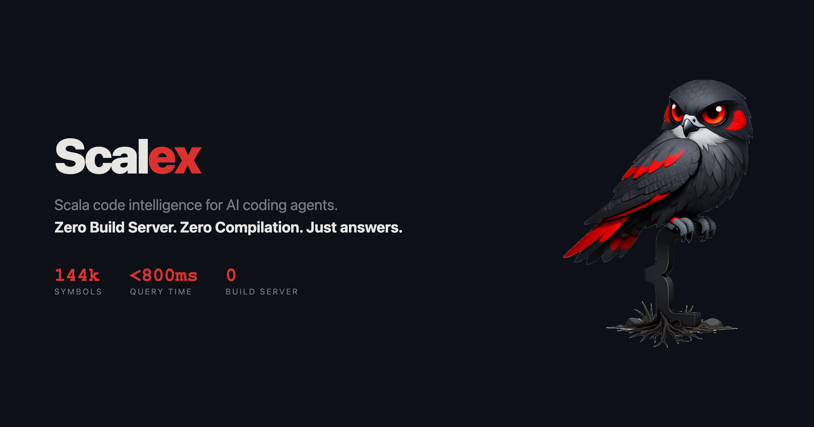

<p align="center">
  <picture>
    <source media="(prefers-color-scheme: dark)" srcset="site/readme-banner-dark.png">
    <source media="(prefers-color-scheme: light)" srcset="site/readme-banner-light.png">
    
  </picture>
  <br>
  <em>Find your way around Scala and Java code.</em>
</p>

Scalex helps coding agents find definitions, explore types, and locate reference candidates in Git-tracked Scala 2, Scala 3, and Java source. It parses code directly, so you can explore a repository without compiling it or starting a build server.

**Install the plugin, open a project, and ask:**

> Use Scalex to explain how requests move through this codebase. Show me the main types and the files to read next.

<p align="center">
  <a href="#install">Install</a> ·
  <a href="#upgrade">Upgrade</a> ·
  <a href="#try-it">Try it</a> ·
  <a href="plugins/scalex/skills/scalex/references/commands.md">Command reference</a> ·
  <a href="docs/DEVELOPMENT.md">Contribute</a>
</p>

## Why Scalex?

- **Start with source.** Explore unfamiliar repositories even when their builds aren't set up.
- **Get useful context in one query.** `explain` brings together a type's definition, documentation, members, and implementations.
- **Follow the structure.** Navigate packages, inheritance, annotations, and method bodies with names and locations attached.
- **Keep agent output manageable.** Use JSON, result limits, and batch queries to fit the task.
- **Leave no process running.** A native executable and a per-repository cache; no daemon to manage.

See it in action:

https://github.com/user-attachments/assets/09391648-1e3a-409c-ad52-19afa99ea81f

## Install

You need Git and a supported platform: **macOS Apple Silicon, macOS Intel, or Linux x64**. The plugin includes an agent skill and a bootstrap script that downloads the native binary on first use and verifies its SHA-256 checksum. No JVM is needed to run that binary.

### Codex CLI and desktop

Run in your terminal:

```bash
codex plugin marketplace add nguyenyou/scalex
codex plugin add scalex@scalex-marketplace
```

Start a new Codex CLI session or desktop task, then ask Codex to use Scalex.

Use a Codex CLI that supports `codex plugin` commands. Scalex is distributed through this repository's marketplace. For plugin setup details, see the [Codex plugin documentation](https://learn.chatgpt.com/docs/plugins).

### Claude Code

Run in your terminal:

```bash
claude plugin marketplace add nguyenyou/scalex
claude plugin install scalex@scalex-marketplace
```

Start a new Claude Code session, or run `/reload-plugins` in an open one, then ask Claude to use Scalex.

### Other coding agents

Copy the shared skill into your agent's skill directory:

```bash
git clone --depth 1 https://github.com/nguyenyou/scalex.git
cp -R scalex/plugins/scalex/skills/scalex /path/to/your/agent/skills/
```

The folder includes the skill, command reference, and binary bootstrap. Follow your agent's instructions for loading new skills.

## Upgrade

Updating the plugin gives your agent the new skill and bootstrap. On the next use, the bootstrap downloads the pinned Scalex release, checks its SHA-256, and caches it alongside older versions. Publishing a GitHub release alone does not update an already-installed bootstrap.

### Codex

For the Git marketplace installed above, run in your terminal:

```bash
codex plugin marketplace upgrade scalex-marketplace
codex plugin add scalex@scalex-marketplace
```

The first command refreshes the Git marketplace snapshot; the second installs the plugin from that refreshed source. Start a new CLI session or desktop task afterward. If the desktop app still shows the old skill, restart it.

For a marketplace pointing to a local directory, update that checkout instead and restart the desktop app. `marketplace upgrade` refreshes configured Git marketplaces. Use `codex plugin marketplace list` to inspect your configured sources.

### Claude Code

Run in your terminal:

```bash
claude plugin marketplace update scalex-marketplace
claude plugin update scalex@scalex-marketplace
```

Start a new Claude Code session, or run `/reload-plugins` in an open one, to apply the update. If you installed at project or local scope, add `--scope project` or `--scope local` to the second command to match that installation.

### Copied skills

Pull the latest source and copy the skill folder into your agent's skill directory again. Reload the agent's skills or start a new session.

## Try it

Ask your agent questions like:

- “Where is `UserService` defined, and what implements it?”
- “Show me the body of `findUser` and the tests that mention it.”
- “What declarations changed since `main`?”

Or try exploring an open-source project:

**Scala 3 compiler**

```bash
git clone --depth 1 https://github.com/scala/scala3.git
```

> Use Scalex to explore how the Scala 3 compiler turns source code into bytecode. Start with a short overview, then show me the entry points.

**Scala.js**

```bash
git clone --depth 1 https://github.com/scala-js/scala-js.git
```

> Use Scalex to explore how Scala.js turns Scala code into JavaScript. Start with a short overview, then show me the entry points.

### CLI examples

The plugin invokes its bundled `scripts/scalex-cli`; it does not add a `scalex` command to your PATH. The examples below use `scalex` as shorthand for that script or a separately installed binary. Run them from the repository you want to explore, or add `-w /path/to/repo`.

```bash
# Find a starting point
scalex overview --concise
scalex search Service --kind trait --limit 10

# Understand a type and read its implementation
scalex explain UserService --brief
scalex members UserService
scalex body findUser --in UserServiceLive

# Explore relationships and changes
scalex impl UserService
scalex refs UserService --count
scalex diff main

# Find test declarations and test-file mentions
scalex tests
scalex coverage UserService
```

For example, invoke the bundled script directly with:

```bash
bash /absolute/path/to/scalex/scripts/scalex-cli def UserService -w /path/to/repo
```

### More to explore

| Task | Commands |
|---|---|
| Find symbols and files | `search`, `def`, `file`, `symbols`, `annotated` |
| Read and understand code | `explain`, `members`, `body`, `doc`, `context` |
| Explore relationships | `impl`, `hierarchy`, `overrides`, `refs`, `imports`, `deps` |
| Explore packages | `overview`, `packages`, `package`, `summary`, `api`, `entrypoints` |
| Inspect changes and tests | `diff`, `tests`, `coverage` |
| Search source patterns | `grep`, `ast-pattern` |
| Inspect the index or share it across queries | `index`, `batch` |
| Render or parse ASCII diagrams | `graph` |

See the [full command reference](plugins/scalex/skills/scalex/references/commands.md) for syntax and supported options, or the [agent skill](plugins/scalex/skills/scalex/SKILL.md) for choosing and interpreting queries.

## How it works

Scalex discovers tracked Scala and Java files through Git, parses them with Scalameta and JavaParser, and stores symbols and search filters in `.scalex/index.bin`. Subsequent invocations reuse unchanged records. Batch queries share one index load.

The binary bootstrap caches each release under `${XDG_CACHE_HOME:-~/.cache}/scalex/`. After the first download, it runs that cached executable.

### Know the boundaries

Scalex describes source syntax. It does not perform compiler type resolution.

- **References are candidates.** Text matches and import-based confidence help narrow the search, but can include comments or unrelated symbols with the same name.
- **Test mentions are not test coverage.** `coverage` finds mentions in test files, not executed lines or verified assertions.
- **Untracked files are absent.** Use ordinary file or text tools for new files that Git does not track.
- **Unstaged edits can leave the index stale.** Cache detection uses Git index OIDs. Verify fresh edits directly; the `index` command does not force a clean rebuild. `diff` reads current source directly.

Use Scalex for source navigation, `rg` for literal text and unsupported files, and a compiler or Metals for type-checked answers and rename refactoring. They work well together.

## Build and contribute

To build a native binary, clone the repository and run:

```bash
git clone --depth 1 https://github.com/nguyenyou/scalex.git
cd scalex
./build-native.sh
./scalex --version
```

The checked-in Mill launcher downloads the pinned GraalVM toolchain and dependencies. For development, you can also run directly through Mill:

```bash
./mill run search /path/to/project MyClass
```

Read the [development guide](docs/DEVELOPMENT.md) for architecture, tests, formatting, performance measurements, and releases. See the [roadmap](docs/ROADMAP.md) for planned work and the [changelog](CHANGELOG.md) for release history.

## Credits

Scalex draws on source-indexing ideas from [Metals](https://scalameta.org/metals/), including Git-based caching and bloom-filter search. It uses [Scalameta](https://scalameta.org/) for Scala parsing, [JavaParser](https://javaparser.org/) for Java parsing, and [Guava](https://guava.dev/) for bloom filters.

The `graph` command is ported from [ascii-graphs](https://github.com/scalameta/ascii-graphs) by Matt Russell.

**Scalex** combines Scala with explore, extract, and index. Its mascot is a kestrel: small, lightweight, and sharp-eyed. Meet it in the [mascot design brief](site/MASCOT.md).

## License

MIT
